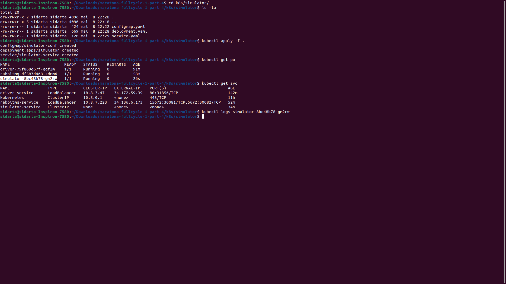

# Maratona Full Cycle - Codelivery - Part IV

O projeto consiste em:

- Um sistema de monitoramento de veículos de entrega em tempo real.

Requisitos:

- Uma transportadora quer fazer o agendamento de suas entregas;
- Ela também quer ter o _feedback_ instantâneo de quando a entrega é realizada;
- Caso haja necessidade de acompanhar a entrega com mais detalhes, o sistema deverá informar, em tempo real, a localização do motorista no mapa.

#### Que problemas de negócio o projeto poderia resolver?

- O projeto pode ser adaptado para casos de uso onde é necessário rastrear e monitorar carros, caminhões, frotas e remessas em tempo real, como na logística e na indústria automotiva.

Dinâmica do sistema:

1. A aplicação _Order_ (_React_/_Nest.js_) é responsável pelas ordens de serviço (ou pedidos) e vai conter a tela de agendamento de pedidos de entrega. A criação de uma nova ordem de serviço começa o processo para que o motorista entregue a mercadoria;

2. A aplicação _Driver_ (_Go_) é responsável por gerenciar o contexto limitado de motoristas. Neste caso, sua responsabilidade consiste em disponibilizar os endpoints de consulta;

3. Para a criação de uma nova ordem de serviço, a aplicação _Order_ obtém de _Driver_ os dados dos motoristas. Neste caso, _REST_ é uma opção pertinente, porque a comunicação deve ser a mais simples possível;

4. Após criar a nova ordem de serviço, _Order_ notifica a aplicação _Mapping_ (_Nest.js_/_React_) via _RabbitMQ_ de que o motorista deve iniciar a entrega. _Mapping_ é a aplicação que vai exibir no mapa a posição do motorista em tempo real. A aplicação _Simulator_ (_Go_) também é notificada sobre o início da entrega e começa a enviar para a aplicação _Mapping_ as posições do veículo;

5. Ao finalizar a entrega, a aplicação _Mapping_ notifica via _RabbitMQ_ a aplicação _Order_ de que o produto foi entregue e a aplicação altera o _status_ da entrega de Pendente para Entregue.

## Tecnologias

#### Operate What You Build

- Nesta quarta versão, é feito o _deploy_ das aplicações no _Google Kubernetes Engine_ (_GKE_). Posteriormente, serão adicionadas as tecnologias de integração contínua e observabilidade.

  - Backend
    - Golang
    - TypeScript
    - Nest.js
    - RabbitMQ
    - MySQL
  - Frontend (Single Page Application (SPA))

    - React

  - Deploy
    - Kubernetes GKE

## Formatos de Comunicação

- _REST_
- Sistema de mensageria (_RabbitMQ_)
- _WebSockets_

### Conceitos de Docker / Kubernetes

- Primeiramente, é válido relembrar alguns conceitos de _Docker_ e _Kubernetes_.

  - Docker

    - O _Docker_ contém containers.
    - _Containers_ são leves, diferentes de máquinas virtuais e equivalem a processos, ou seja, no momento que determinado processo morre, o _container_ também cai.
    - Um _container_ é baseado em:

      - _Namespaces_ (Isola os processos);
      - _Cgroups_ (Controla os recursos computacionais (memória, _CPU_, etc.));
      - _Overlay File System_ (_OFS_).
        - Ao baixar a imagem, são baixados pedaços (_chunks_) de imagens. O _OFS_ controla para que pedaços em comum com outras imagens não sejam baixados novamente.

    - O que é a imagem?

      - Imagem é uma espécie de _template_ e o seu estado é imutável, ou seja, ela nunca muda.
      - A imagem é gerada a partir do _Dockerfile_ e é guardada (ou hospedada) no _Image Registry_ (como o _DockerHub_, por exemplo);

    - Como que é criado o _container_?
      - A partir da imagem. O _container_ utiliza a imagem para executar um processo.

  - Kubernetes

    - Como publicar a imagem de uma aplicação no _cluster_?

      - Para isso, é necessário criar um _Deployment_, aonde é definido a imagem que deve ser baixada do _Image Registry_;
      - A partir do _Deployment_, são definidas quantas réplicas do _Pod_ serão geradas automaticamente pelo _Kubernetes_.

    - Como obter acesso aos containers dentro do _cluster_?

      - A partir da criação de _Services_.
        - Dependendo do tipo de _Service_, ele vai poder se comunicar com outros _containers_ e _Services_ dentro do _Kubernetes_ a partir da definição da porta (_NodePort_) ou do _IP_ (_ClusterIP_).
        - Já o _LoadBalancer_ disponibiliza um acesso externo ao _container_.

#### Criação do Cluster Kubernetes

Para o _deploy_ das aplicações, primeiramente, é necessário criar um _cluster_ no _Kubernetes_.

Será criado um _cluster_ seguindo a configuração padrão do _GKE_ (_Standard Cluster_).


Mantendo o número de máquinas recomendado (_Number of nodes_: 3).


Após clicar em _Create_ e aguardar alguns minutos, é criado o _cluster_ com as configurações padrões:

- _Number of nodes_: 3;
- _Total vCPUs_: 6;
- _Total memory_: 12GB


#### Conectar no Cluster

A partir do Painel do _GCP_ (_Kubernetes Engine_ / _Clusters_), é possível copiar o comando para conectar no _cluster_ via linha de comando:

```
gcloud container clusters get-credentials cluster-1 --zone us-central1-c --project maratona-fullcycle-385818
```


Para confirmar o ingresso, pode-se rodar um comando apenas para verificar as máquinas contidas no _cluster_.


### Execução dos manifestos Kubernetes

#### Aplicação Driver

- Ir até o diretório `k8s/driver`;
- Aplicar os manifestos com o comando `kubectl apply -f .`;
- Verificar a criação do _Pod_ e _Service_:


- Verificar o retorno do _endpoint_ `/drivers`:


- Configurar o _DNS_ `codelivery-driver.sidartaoss.com` para o _IP_ externo do _Kubernetes_ _Service_:


- Verificar o retorno do _endpoint_ `/drivers` a partir do _DNS_ criado:


#### RabbitMQ

- Ir até o diretório `k8s/rabbitmq`;
- Aplicar os manifestos com o comando `kubectl apply -f .`;
- Verificar a criação do _Pod_ e _Service_:


- Configurar o _DNS_ `codelivery-rabbitmq.sidartaoss.com` para o _IP_ externo do _Kubernetes_ _Service_:


- Acessar o Painel Administrativo do _RabbitMQ_ a partir do _DNS_ criado:


#### Aplicação Simulator

- Ir até o diretório `k8s/simulator`;
- Aplicar os manifestos com o comando `kubectl apply -f .`;
- Verificar a criação do _Pod_ e _Service_:



- N.T.: A aplicação _Simulator_ tem um arquivo _.env_ que define as variáveis de ambiente. O _ConfigMap_ vai injetar na raiz da aplicação, ou seja, em `/app/.env`, o conteúdo que é definido pela propriedade _env_.

#### Aplicação Mapping / Frontend

- Ir até o diretório `k8s/mapping/frontend`;
- Aplicar os manifestos com o comando `kubectl apply -f .`;
- Verificar a criação do _Pod_ e _Service_:


- Configurar o _DNS_ `codelivery-mapping-frontend.sidartaoss.com` para o _IP_ externo do _Kubernetes_ _Service_:


#### Aplicação Mapping / MySQL

- Ir até o diretório raiz;
- Executar o comando:

```
kubectl create secret generic mysql-pass --from-literal=password='root'
```


- N.T.: Esse comando cria um _Kubernetes_ _Secret_ com o nome de _mysql-pass_. Quando for configurado o _MySQL_, ele deve consultar o valor de _password_ a partir desse _Secret_ e não a partir do manifesto, para que a senha não fique exposta no manifesto.

- Ir até o diretório `k8s/mapping/backend/mysql`;
- Aplicar os manifestos com o comando `kubectl apply -f .`;
- Verificar a criação do _Pod_ e _Service_;


- N.T.: No manifesto de _Deployment_, é definido um _persistent storage_. O que isso quer dizer?

  - Isso significa que, apesar de o _MySQL_ rodar como um _container_, os dados serão persistidos no disco. Dessa forma, quando o _container_ morrer, os dados não serão perdidos.
  - Mas, para criar o _persistent storage_, é necessário requerer um volume. Isso é feito por meio de uma _claim_ (_persistentVolumeClaim_), que solicita um volume ao _Kubernetes_.
  - O _Kubernetes_, então, vai obter o volume a partir de um local do disco ou, no caso de uma _cloud_, a partir de um _block storage_. Ao final, ele monta o volume e relaciona diretamente no _container_.

- Criar base de dados de _micro_mapping_;

  - Ir até o diretório `micro-mapping/backend/.docker/mysql`;
  - Copiar _script_ do arquivo _initdb.sql_.
  - Obter a lista de _Pods_: `kubectl get po`;
  - Entrar no _container_ do _Pod_ _MySQL_: `kubectl exec -it map-mysql-7d4f6c79c-2crcr bash`;
  - Criar a base de dados de _micro_mapping_ e a tabela _orders_ a partir de _initdb.sql_;


#### Aplicação Mapping / Backend

- Ir até o diretório `k8s/mapping/backend`;
- Aplicar os manifestos com o comando `kubectl apply -f .`;
- Verificar a criação do _Pod_ e _Service_:


- N.T.: A aplicação _backend_ de _Mapping_ tem um arquivo _.env_ que define as variáveis de ambiente. O _ConfigMap_ vai injetar na raiz da aplicação, ou seja, em `/home/node/app/.env`, o conteúdo que é definido pela propriedade _env_.

- Configurar o _DNS_ `codelivery-mapping-backend.sidartaoss.com` para o _IP_ externo do _Kubernetes_ _Service_:


#### Aplicação Order / MySQL

- Ir até o diretório `k8s/order/mysql`;
- Aplicar os manifestos com o comando `kubectl apply -f .`;
- Verificar a criação do _Pod_ e _Service_:


- Criar base de dados de _micro_order_;

  - Ir até o diretório `micro-order/.docker/mysql`;
  - Copiar _script_ do arquivo _initdb.sql_.
  - Obter a lista de _Pods_: `kubectl get po`;
  - Entrar no container do _Pod_ _MySQL_: `kubectl exec -it order-mysql-557c98cc5c-9xqc6 bash`;
  - Criar a base de dados de _micro_orders_ e a tabela _orders_ a partir de _initdb.sql_;

  

#### Aplicação Order

- Ir até o diretório `k8s/order`;
- Aplicar os manifestos com o comando `kubectl apply -f .`;
- Verificar a criação do _Pod_ e _Service_:


- Configurar o _DNS_ `codelivery-order.sidartaoss.com` para o _IP_ externo do _Kubernetes_ _Service_:


#### RabbitMQ

- Acessar o Painel Administrativo do _RabbitMQ_: `http://codelivery-rabbitmq.sidartaoss.com:15672/`;

- Adicionar um _Bind_ à fila _micro-simulator/orders-new_ - _From exchange_: _amq.direct_; _Routing key_: _orders.new_;

### Execução

#### Orders

- Acessar a `Listagem de pedidos`: `http://codelivery-order.sidartaoss.com/orders`;

- Clicar `Novo Pedido`;

- Selecionar _Motorista_ e _Destino_;

- Clicar `Enviar`;

- Um novo pedido com _ID_ `7bce6e8c-4a15-4713-bdbf-6dec9547b9e5` é criado como _Pendente_;


- Clicar `Ver mapa`;


- Após chegar no destino, verificar o pedido como _Entregue_ na tela de `Listagem de pedidos`;


